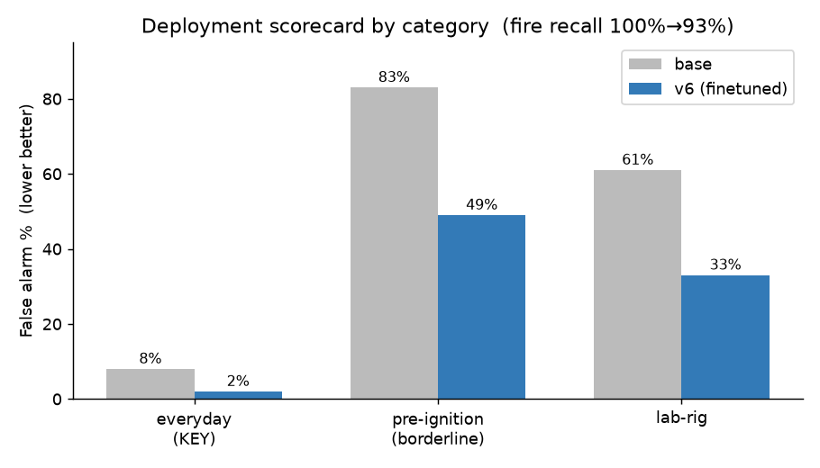
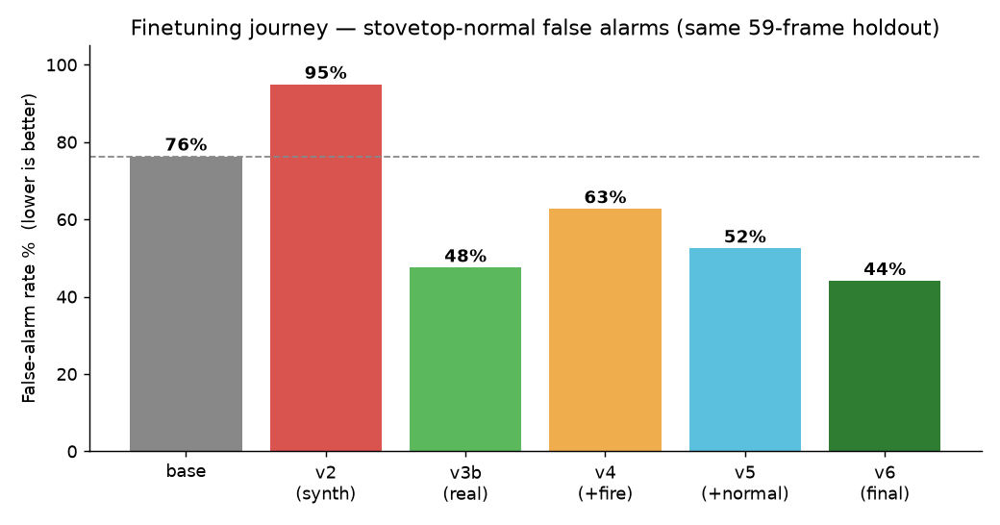
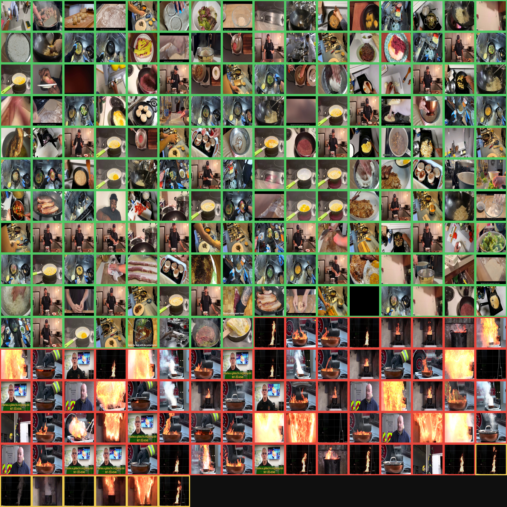
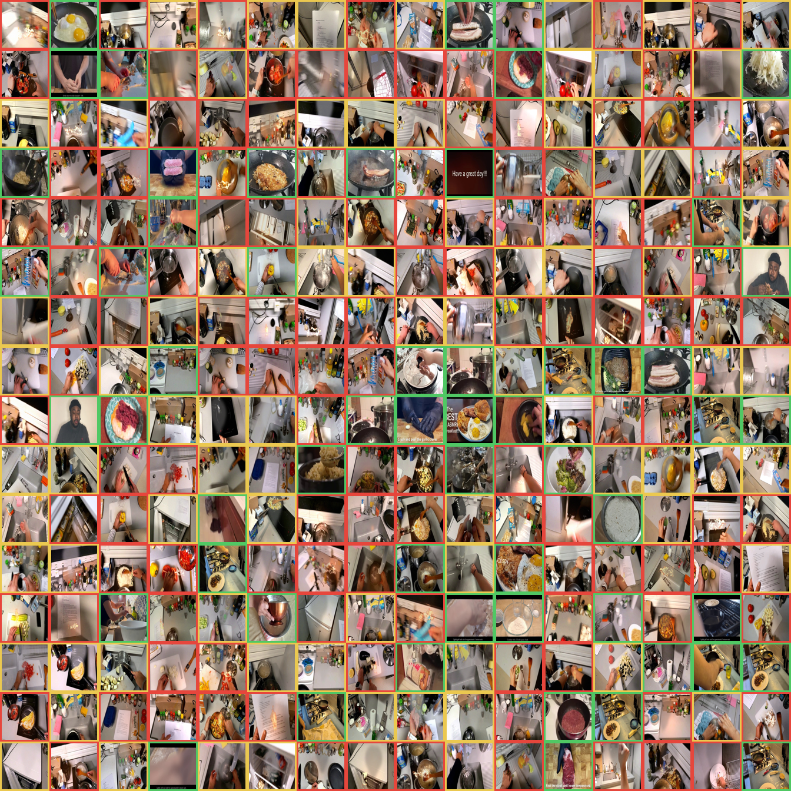

# 조리 위험 인식 VLM (PoC)

소형 비전-언어 모델(**Qwen2.5-VL-3B**)을 파인튜닝해, 조리 중 장면을
**정상 / 발연(smoke) / 화재(fire)** 로 인식하고 **헛경보(오탐)를 줄이는** 것이 목표.
CCTV로 조리기를 감시해 위험 시 로봇 반응(정지/열원차단)을 트리거하는 시스템의 **인식** 부분.

> 전체 근거·서술: [docs/HANDOFF.md](docs/HANDOFF.md) · 결과 원본: [results/](results/)

## 핵심 결과
실제 배포에서 흔한 **일상 스토브 조리**의 오탐률을 파인튜닝으로 **8% → 2%** 로 낮춤(화재 재현율 93% 유지).



- 그동안 무섭게 보인 "오탐 52~76%"는 **적대적 홀드아웃 프레임**(발화 직전 팬 + 어두운 실험장치) 탓이었음.
  범주를 나누니 파인튜닝이 **모든 범주에서 오탐을 낮춤**.

---

## 실험 여정 (STEP 0 → 5)

| STEP | 한 일 | 핵심 결과 |
|---|---|---|
| **0** | 기본 VLM 화재 F1 측정 (야외 D-Fire) | F1 0.819, 재현율 0.97 → 단순 화재감지는 약함 |
| **0-C** | 조리 도메인 재측정 | 정상 오탐 15/44%, 발연 100% 오답 → 진짜 문제는 "오탐 억제 + 단계 인식" |
| **1** | 위험 홀드아웃 실물화 | D-Fire(야외) 부적합 확인 → NIST FCD 조리유 팬 화재로 v0 구축 |
| **1b** | 실주방 화재 영상 수집·라벨 | DVIDS(공개도메인)+소방서 실연 → 홀드아웃 fire 10→71 |
| **2** | 합성 파이프라인 | 실 조리 프레임 위 불꽃/발연 합성 |
| **2b** | 실데이터 학습셋 | 실 조리화재 영상(정상+화재) 픽셀 휴리스틱 라벨 |
| **4** | QLoRA 파인튜닝 (v2~v5) | 아래 표 |
| **5** | 홀드아웃 재정의 → 배포 지표 | 일상 오탐 8→2% (배포 가능 수준) |

## 파인튜닝 버전별 — 무엇을 바꿨나

| 버전 | 학습 데이터 | 스토브 정상 오탐* | 판정 |
|---|---|---|---|
| base | (프롬프트만) | 76% | 기준 |
| **v2** | 합성 불꽃(조리배경) 460 | **95%** | 합성이 "조리=위험" 편향 유발 → 악화 |
| **v3b** | 실 정상 180 + 실 화재 109 | **47.5%** | 실데이터가 처음으로 base 초과 |
| **v4** | 실 정상 250 + 실 화재 180(+야외 터키) | 62.7% | 화재 과다·야외 → 악화 |
| **v5** | 실 정상 ~400(12영상) + 실 화재 110 | 52.5% | 실주방 오탐은 크게↓(dvids 93→59%) |
| **v6** | v5에서 홀드아웃 3영상 제외 재학습 | **44.1%** | 최저 오탐 + 배포 지표(일상 2%) 확보 |

<sub>*값 = **오탐률**(정상을 위험으로 오판한 비율). 전부 동일한 holdout_v0/normal **59장**(발화직전+랩리그) 기준. v6의 "일상 정상" 오탐은 2%(아래 배포 스코어카드).</sub>



> 막대 **% = 오탐률**(낮을수록 좋음). base 76% → 합성(v2)은 95%로 악화 → 실데이터 도입 후 계속 하락 → **v6 44%로 최저**.

**교훈:** 합성은 해로웠고(가짜 상관 학습), **실 정상 데이터가 오탐을 줄이는 지렛대**. 실 화재를 더 넣는 건 오히려 역효과.

## 배포 스코어카드 (base vs v6, 범주별)

| 범주 | base | v6 |
|---|---|---|
| **일상 스토브 정상 (핵심)** | 8% | **2%** |
| 일상 LEMONADE(오버헤드) | 2% | 0% |
| 발화 직전(경계, 회색지대) | 83% | 49% |
| 랩리그(비대표) | 61% | 33% |
| **fire 재현율** | 71/71 | 66/71 |
| smoke 재현율 | 7/7 | 4/7 |

**트레이드오프:** 오탐을 줄인 대신 fire 재현율 100%→93%. 안전 시스템에선 미탐이 더 위험하므로 동작점 재조정 필요.

## 데이터 미리보기

**실제 추출한 프레임** (테두리 색 = 라벨: 🟩정상 🟥화재 🟨발연). 다양한 주방의 스토브 조리·실 화재:



**합성 이미지** (같은 형식) — 실 조리 프레임 **위에** 실 불꽃 컷아웃/절차적 연기를 합성. 배경=실주방 유지:



> 합성은 "조리배경 위 불/연기"라 학습 시 "조리=위험" 편향을 유발 → 실데이터 대비 오탐 악화(위 v2). 그래서 최종 학습은 합성 대신 실데이터 위주.

## 방법 (파이프라인)
```
영상 검색(yt-dlp) → 프레임 추출(cv2) → 라벨(픽셀 휴리스틱/시간구간) → QLoRA SFT(LLaMA-Factory) → 범주별 배포 평가
```
- 영상 단위 train/holdout split로 누수 차단 ([data/holdout_real/sources.json](data/holdout_real/sources.json))
- 주요 스크립트: `scripts/step0*_*.py`(베이스라인), `collect_incident_frames.py`(수집), `step1b_label_flat.py`·`step2b_build_real_train.py`(라벨·학습셋), `step4_*.py`·`step5_deploy_eval.py`(학습·평가)

## 재현
```bash
uv run --group train python scripts/step0c_cooking_baseline.py       # 조리 도메인 베이스라인
uv run --group train --group collect python scripts/collect_incident_frames.py  # 영상→프레임
uv run python scripts/step2b_build_real_train.py --cap-normal 400 --cap-fire 110 --smoke 0  # 실데이터 학습셋
uv run python scripts/step4_make_vqa.py                               # VQA 변환
uv run llamafactory-cli train configs/qwen2_5vl_cooking_qlora.yaml    # 학습
uv run --group train python scripts/step5_deploy_eval.py [--adapter out/qwen2p5vl-3b-cooking-qlora]  # 배포 평가
```
대용량(영상·프레임·합성·어댑터)은 git 제외, 위 스크립트로 재생성.

## 결론 & 한계
- **방향은 현실성 있음**: 실 조리 데이터로 일상 오탐을 배포 가능 수준(2%)까지 낮춤.
- 남은 난제(명확히 좁혀짐): ① fire 재현율 회복(동작점·데이터 비율), ② 발화 직전(경계)을 **조기경보 클래스**로 재설계, ③ 발연(smoke) 실데이터(사용자 촬영).

## 기반: LEMONADE VLM Finetune (이전 단계)
이 PoC는 [LEMONADE VQA](https://arxiv.org/abs/2506.01608) 파인튜닝 인프라(프레임 추출·uv·LLaMA-Factory)를 재활용한다.
LEMONADE 조리 프레임은 여기서 "일상 정상" 데이터로도 쓰인다. (원 프로젝트: Qwen2.5-VL-3B, 조리 행동 4지선다 41%→71.5%.)
